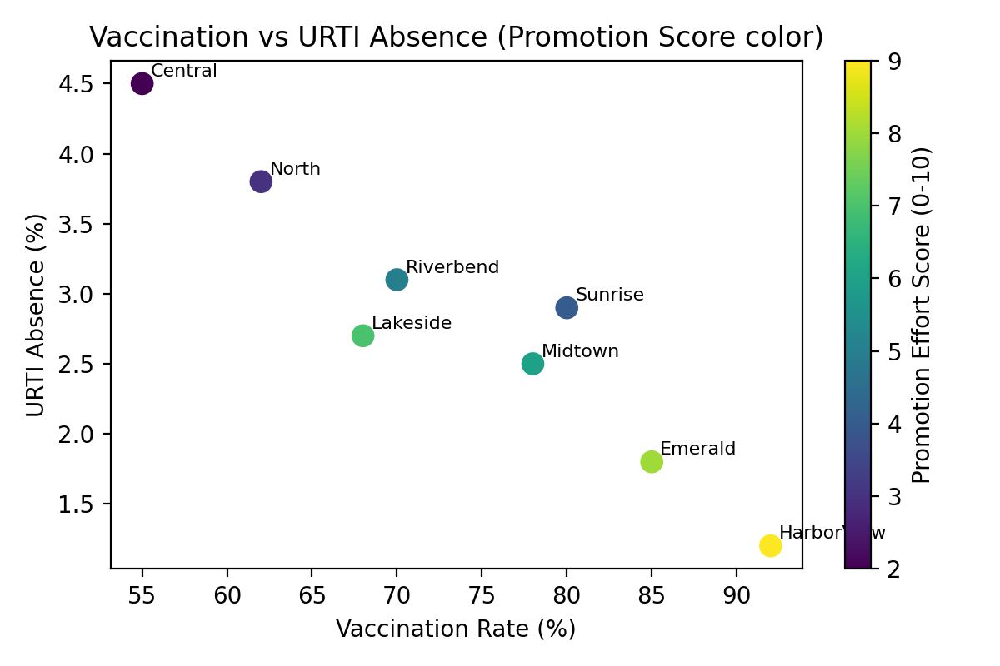
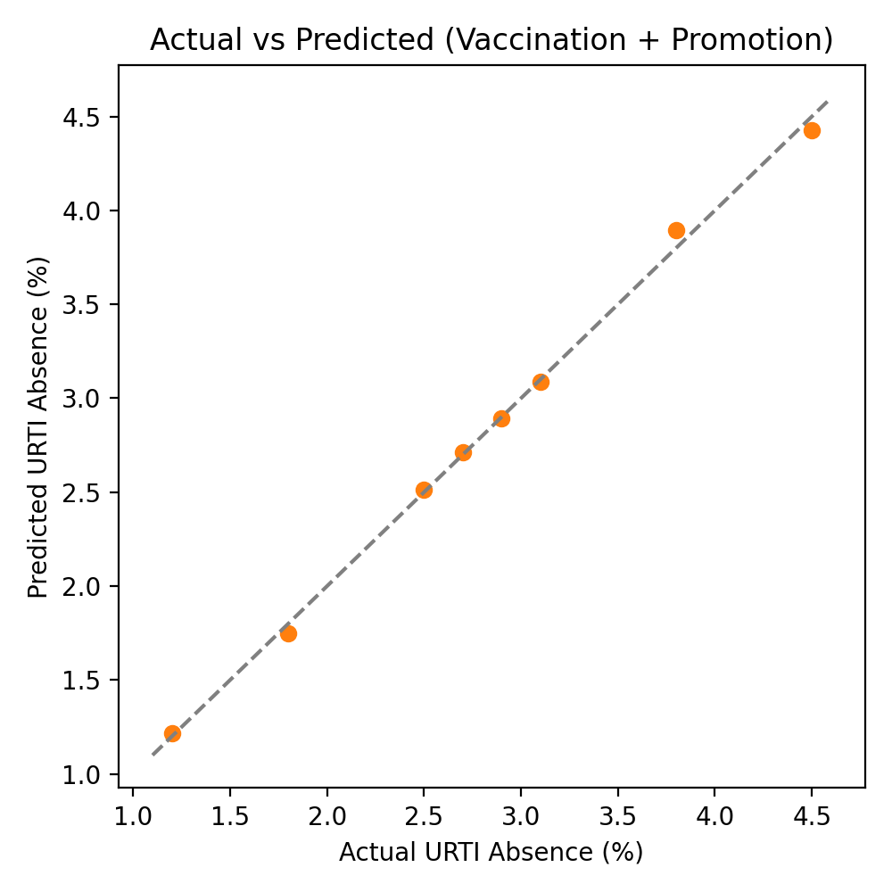

## School Report Card Model with Promotion Variables

### 1. Motivation
While vaccination coverage is the primary lever, school-level promotional efforts (workshops, SMS reminders, PTA outreach) can independently improve parent uptake. To capture this effect, we extended the report-card model to include a promotion variable alongside vaccination rates, enabling EDB to recognize schools that invest in outreach and to diagnose those underperforming despite ample promotions.

### 2. Synthetic Dataset
- File: `data/synthetic_school_report_card_with_promo.csv`
- Columns:
  - `VaccinationRatePct`: influenza vaccination percentage.
  - `PromotionEffortScore`: composite 0-10 index (weighted sum of workshops, SMS reminders, PTA activities).
  - `ParentWorkshopsPerTerm`, `SMSRemindersPerTerm`: raw promotional inputs.
  - `URTIAbsencePct`: percentage of students taking URTI-related sick leave.
  - `Enrollment`: total students (context for weighting).

### 3. Regression Model
We estimate a two-variable OLS regression using numpy least squares:

$$
\widehat{\text{URTI Absence}}_i = \beta_0 + \beta_1 \cdot \text{VaccinationRate}_i + \beta_2 \cdot \text{PromotionScore}_i
$$

Estimated coefficients (from `figures/promo_regression_summary.txt`):

- $ \beta_0 = 7.252 $
- $ \beta_1 = -0.043 $ (per +1% vaccination)
- $ \beta_2 = -0.232 $ (per +1 promotion score)

Interpretation:
- Increasing vaccination by 10 percentage points reduces URTI absenteeism by ~0.43 percentage points, holding promotion constant.
- Raising the promotion score by 3 points (e.g., more workshops and reminders) reduces URTI absences by ~0.7 percentage points even if vaccination remains unchanged, illustrating the added value of outreach.

Hypothesis consistency: aligns with Leung et al. (2017) showing vaccinated cohorts have fewer ILI episodes, and extends it by quantifying the pathway where promotions boost vaccination intentions (supported by outreach literature referenced in Lee et al. 2024).

### 4. Visualizations
- Vaccination vs URTI absence, colored by promotion score  
  `figures/vaccination_vs_absence_promo.png`

- Actual vs predicted URTI absence (vaccination + promotion model)  
  `figures/actual_vs_predicted_promo.png`

### 5. Report Card Application
1. **Score computation**: use the regression to predict expected URTI absences; compare against actuals to flag schools underperforming relative to both vaccination and promotion effort.
2. **Promotion incentives**: EDB can reward schools with high promotion scores even if structural barriers limit immediate vaccination gains, while insisting on improvement plans for low-promotion schools.
3. **Dashboard fields**:
   - Vaccination rate.
   - Promotion score (with breakdown: workshops, SMS, PTA).
   - Actual vs predicted URTI absence.
   - Alert when both vaccination and promotion fall below thresholds.

### 6. Reproduction Steps
1. Load the CSV (above).
2. Run the numpy regression script (`python ...` snippet from `School_Vaccination_Report_Card.md` or reuse `figures/promo_regression_summary.txt`).
3. Generate scatter and actual-vs-predicted charts (files listed above).
4. Embed metrics into the report card and tie to EDB enforcement levers (SDA reviews, principal appraisal, resource allocation).

