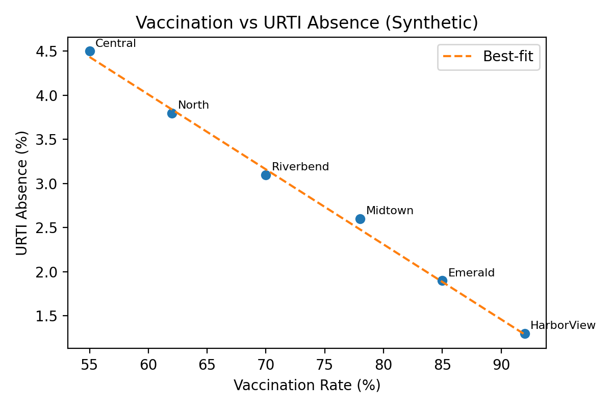
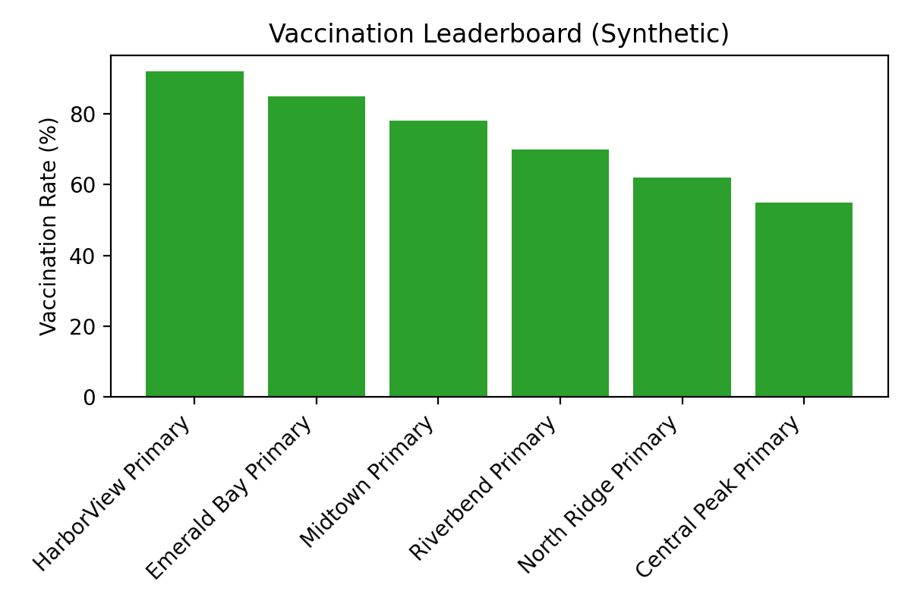
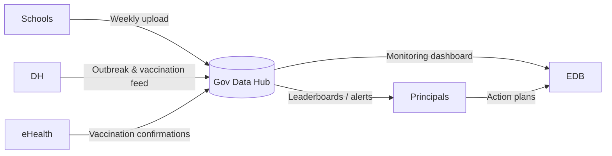

## School Vaccination Report Card — Technical Outline

### 1. Purpose & Accountability Vision
- Create a transparent, data-driven “report card” that ranks schools on influenza prevention readiness and forces principals to act.
- Move beyond simple bean-counting (raw vaccination %), incorporating absenteeism, outbreak risk, and engagement indicators that tie directly to health outcomes.

### 2. Mathematical Modeling Focus (Simple, Actionable)
- **Hypothesis**: Higher vaccination rates lead to lower URTI-related absenteeism.
- **Primary analysis**
  - Scatter/regression of vaccination % vs URTI absentee rate per school (linear or log-linear).  
  - Control for school size and basic demographics as needed.
  - Identify outliers (high absence despite high vaccination) for qualitative review.
- **Leaderboard / ranking**
  - Rank schools by vaccination %, absenteeism, and combined “Protection Score” (e.g., z-score blend).  
  - Publish quartiles to create peer pressure; highlight “rapid improvers.”
- **Insights sought**
  - Quantify marginal reduction in sick days per +10% vaccination.
  - Illustrate gap between top and bottom quartile schools.
  - Provide simple charts that principals, parents, and EDB can interpret quickly.

### 3. Data Inputs Needed
- **Core metrics (Bean counting)**
  - Vaccination uptake per class (dose 1/2), consent form return rates, eHealth ID linkage counts.
  - Outreach program participation (on-site vs off-site), resource utilization logs.
- **Health outcomes**
  - Daily attendance with coded reasons (URTI, influenza, other), duration of absence, confirmed cases reported to DH.
- **Contextual factors**
  - School size, socio-economic indicators, SEN population, historical outbreaks, ventilation readiness audits.
- **Engagement indicators**
  - PTA meeting attendance, number of parent info sessions, distribution metrics for health communications.

### 4. Ideal Data Governance for the Report Card
- **Collection**
  - Schools upload weekly vaccination % (per class) and URTI-coded absences; format kept simple (CSV template).
  - DH shares aggregate outbreak alerts for context.
  - eHealth confirms vaccination events to reduce under-reporting.
- **Validation**
  - Basic logic checks (vaccination % ≤ 100, absentee counts match total absences).
  - Random audits comparing school reports with eHealth-confirmed vaccinations.
- **Access & Security**
  - Principals/PTAs get dashboards; EDB has territory-wide view to intervene.
  - Follow PDPO via pseudonymized student data; only aggregated metrics displayed.

### 5. Questions for Government Agencies (with provisional assumptions)
- **To DH**
  - What dataset granularity (school-level vs aggregated) can be shared for vaccination uptake and outbreaks?
  - Assume we can obtain weekly updates but validate: what is their current refresh cycle?
- **To EDB**
  - Are attendance reason codes standardized territory-wide? If not, what mandate is needed?
  - Assume EDB can integrate the report card into school quality reviews—confirm appetite and constraints.
- **To HB / eHealth**
  - Can eHealth generate school-linked vaccination stats via parent consent? What legal steps required?
  - Assume a pilot opt-in is feasible; request clarity on API readiness and privacy safeguards.

### 6. Dashboard & Pressure Mechanisms
- **Principal View**
  - Vaccination vs absentee scatter plot with school highlighted.
  - Leaderboard rank, quartile badge, and target line (e.g., ≥80% vaccinated, ≤2% URTI absence).
  - Alerts when performance slips relative to peers.
- **EDB Command Center**
  - District-level heatmap of vaccination and absence quartiles.
  - List of schools below thresholds; link to required action plans.
- **Public/Parent Snapshot (optional)**
  - Simple “Green/Amber/Red” badge once data stabilized to motivate parental engagement.
- **Pressure levers**
  - EDB references report card in school development reviews and principal appraisal.
  - Targeted communications to PTAs highlighting standings.

### 7. Workplan for Report Card Build
1. **Week 1**: Finalize data inputs (vaccination %, URTI absences), request letters.
2. **Week 2–3**: Build synthetic dataset; run simple regression and leaderboard logic.
3. **Week 4**: Create dashboard prototypes; gather supervisor feedback.
4. **Week 5**: Document governance requirements + EDB engagement strategy.
5. **Week 6**: Integrate findings into main report and advocacy deck.

### 8. Immediate Tasks
- [ ] Draft simple regression spec (variables, expected coefficient interpretation).  
- [ ] Produce sample leaderboard layout (top/bottom quartiles, badges).  
- [ ] Prepare questionnaire for DH/EDB/HB on vaccination & absence reporting.  
- [ ] Outline EDB-school relationship lever (quality reviews, funding incentives, principal appraisal).

### 9. Synthetic Data Prototype & Illustrative Insights
- **Dataset**: `01_Project_Report/data/synthetic_school_report_card.csv` (six anonymized schools with vaccination %, URTI absence %, enrollment, outreach, eHealth uptake, PTA engagement).
- **Regression example**  
  - Model: `URTI_absence_pct = 9.11 − 0.085 × vaccination_rate_pct` (derived from synthetic data).  
  - Interpretation: each +10 percentage-point gain in vaccination is associated with ~0.85 percentage-point drop in URTI absences; moving from 60% to 80% vaccinated could halve sick days.  
  - Outliers: schools below the regression line (e.g., Riverbend) show higher-than-expected absences → targeted audit.
- **Leaderboard snapshot**

| Rank | School               | Vaccination % | URTI Absence % | Badge  |
|------|---------------------|---------------|----------------|--------|
| 1    | HarborView Primary  | 92%           | 1.3%           | Gold   |
| 2    | Emerald Bay Primary | 85%           | 1.9%           | Silver |
| 5    | North Ridge Primary | 62%           | 3.8%           | Amber  |
| 6    | Central Peak Primary| 55%           | 4.5%           | Red    |

- **How EDB applies pressure**
  - Embed report-card results into annual School Development & Accountability (SDA) cycle; principals must submit action plans if ranked Amber/Red.
  - Tie improvement targets to Principal Continuous Professional Development requirements and appraisal conversations.
  - Use Education Bureau’s Quality Assurance Inspection teams to review data collection processes and verify corrective actions.
  - Link discretionary grants (e.g., extra nurse support) to demonstrated progress in vaccination + absentee metrics.

### 10. Visualizations & LaTeX Math
- **Regression formula (LaTeX)**

```math
\widehat{\text{URTI Absence}}_i = \beta_0 + \beta_1 \cdot \text{VaccinationRate}_i
  = 9.11 - 0.085 \cdot \text{VaccinationRate}_i
```

- **Scatter chart**  
  `figures/vaccination_vs_absence.png`



- **Leaderboard bar chart**  
  `figures/vaccination_leaderboard.png`



- **Scatter plot concept (vaccination vs URTI absence)**

```python
import pandas as pd, matplotlib.pyplot as plt
df = pd.read_csv("data/synthetic_school_report_card.csv")
plt.figure(figsize=(6,4))
plt.scatter(df["VaccinationRatePct"], df["URTIAbsencePct"], color="#1f77b4")
for _, row in df.iterrows():
    plt.annotate(row["School"].split()[0], (row["VaccinationRatePct"], row["URTIAbsencePct"]))
x = df["VaccinationRatePct"]
plt.plot(x, 9.11 - 0.085*x, color="#ff7f0e", linestyle="--", label="Best-fit line")
plt.xlabel("Vaccination Rate (%)")
plt.ylabel("URTI Absence (%)")
plt.legend()
plt.tight_layout()
plt.show()
```

- **Leaderboard bar chart**

```python
df_sorted = df.sort_values("VaccinationRatePct", ascending=False)
plt.bar(df_sorted["School"], df_sorted["VaccinationRatePct"], color="#2ca02c")
plt.xticks(rotation=45, ha="right")
plt.ylabel("Vaccination Rate (%)")
plt.title("Vaccination Leaderboard")
plt.tight_layout()
plt.show()
```

- **Governance flow diagram (Mermaid)**



- **Dashboard mock-up elements**
  - **Card 1**: `Vaccination Rate: 85% (▲ +3% vs last term)`  
  - **Card 2**: `URTI Absence: 1.9% (▼ -0.4% vs district avg)`  
  - **Card 3**: Leaderboard rank, quartile badge, and call-to-action button (`Submit improvement plan` for Amber/Red).

